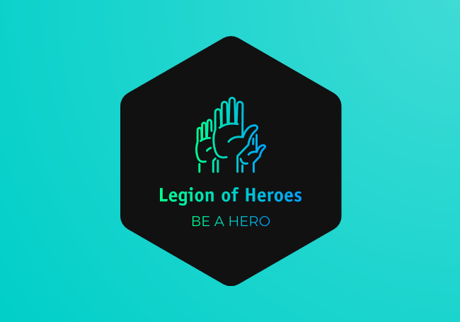

# legion-of-heroes

The idea for this project is to build an application that can connect Users and ONGs that need help, of monetary nature or not, with people who are willing to help.

- ONGs and Users seeking help create an "incident" post that describes what kind of help they need.
- ONGs and Users will have different Account Setup, being treated different in the database and backend.
- ONGs will potentially be able to "Verify" themselves with local authorities to validate their legitimacy.
- Incidents can also have embedded Videos, that can be used to paint a better picture of the situation.
- Users who want to help, can navigate through the incidents published using "location", "organization", etc as search parameters.
- Helping Users can then contact the Help Seeker entity via email or phone/whatsapp.
- No Monetary transactions will be carried by the application under any circumstances

## Technical Summary

- Database
  - MySQL Engine running on AWS RDS
  - Using Knex.js query builder for queries coming from the backend
  - Access to DB from Backend provided via AWS IAM User
- Backend
  - Developed using NodeJS 12.6.0 with the addition of top-tier 3rd party libraries
  - Communicates with the Web and Mobile apps via REST API calls
  - Hosted in a 100% Serverless environment, using AWS Lambda as FaaS
  - Credentials are stored in AWS Secrets Manager and will be loaded into the code only during runtime, using in-code calls to AWS SM.
  - Access to AWS SM is provided via AWS IAM Role
- Web app
  - Developed using ReactJS Framework addition of top-tier 3rd party libraries
  - Available in any modern browser
- Mobile app
  - Developed using React Native Framework
  - Mobile App will initially be available only on Android OS. iOS version will be available at a later stage.
  - Application will initially be available on at Google Play Store. App will be added to App Store when launching the iOS Version.
